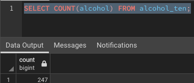

# Wine_Store_DB

## Objective
Create a database of wines that have a quality score of at least 7 for an online store.  The goal is to keep track of the available wines based on the quality score, alcohol content, and wine color.  

- Quality: Graded from 0 (very bad) to 10 (very excellent)
- Alcohol: Percentage of alcohol content.
- Color: Red and white wines are available.  Heavy wines generally have a deeper color.

## Tasks
1. Import red and white wine csv files to Jupyter Notebook for analysis.
2. Create a Pandas DataFrame from the red and white wine csv files.
3. Clean DataFrames to remove any rows missing data.
4. Add a column for wine color to both DataFrames.
6. Concat the 2 DataFrames together.
7. Filter new DataFrame for a quality score that is at least 7.
8. Export the concated DataFrame to a new csv file and import into pgAdmin 4.
9. Create tables in pgAdmin 4 based on quality score, alcohol content, and wine color.

## Resources
### Tools
- jupyter notebook 6.4.5
- pgAdmin 4
- visual studio code 1.67.2 
- python 3.9
- pandas 1.3.4

### Data
- Wine Datasets (https://archive.ics.uci.edu/ml/datasets/Wine+Quality)

## Samples of the Database Tables
### Quality Score 7

### Quality Score 8

### Quality Score 9

### Alcohol Content Between 10 and 10.9

### Alcohol Content Between 12 and 12.9

### Alcohol Content Between 14 and 14.9

### Color Red

### Color White

## Row Count of Database Tables
### Quality Score 7 Count

### Quality Score 8 Count

### Quality Score 9 Count

### Alcohol Content Between 8 and 8.9 Count

### Alcohol Content Between 9 and 9.9 Count

### Alcohol Content Between 10 and 10.9 Count

### Alcohol Content Between 11 and 11.9 Count

### Alcohol Content Between 12 and 12.9 Count

### Alcohol Content Between 13 and 13.9 Count

### Alcohol Content Between 14 and 14.9 Count

### Color Red Count

### Color White Count

